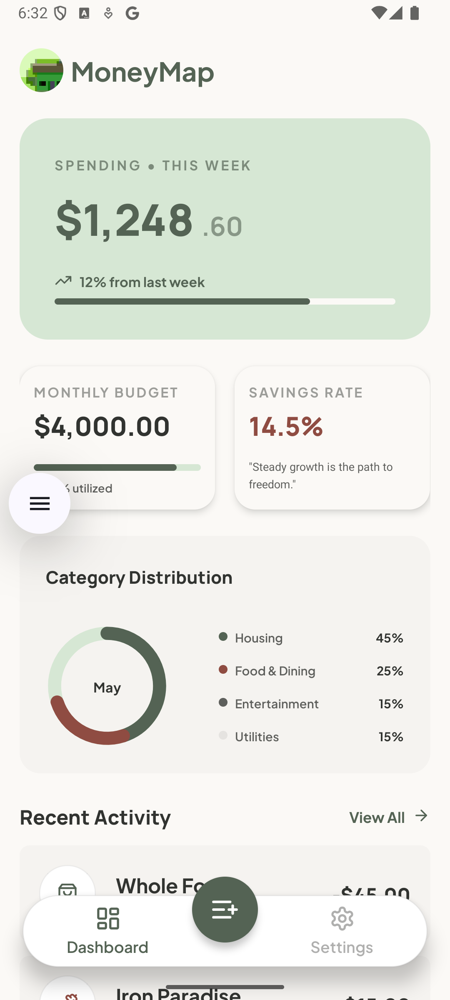
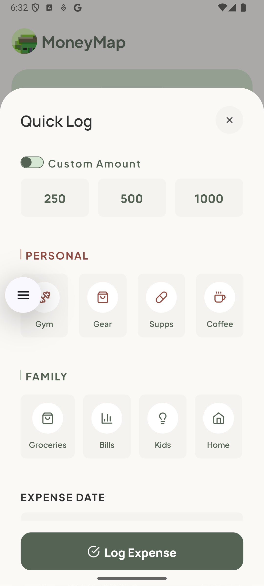
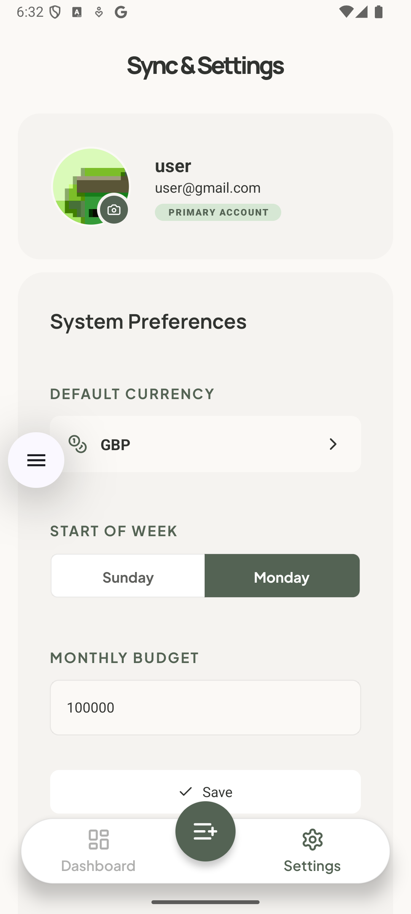
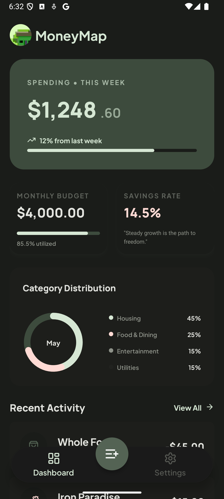

# MoneyMap

A personal finance tracking mobile app for managing expenses, budgets, and savings goals.

|                  Dashboard                   |                  Add Expense                   |                  Activity                   |                  Dark Mode                   |
| :------------------------------------------: | :--------------------------------------------: | :-----------------------------------------: | :------------------------------------------: |
|  |  |  |  |

## Tech Stack

- **Mobile**: Expo SDK 54, React Native 0.81
- **Backend**: Firebase (Auth, Firestore)
- **UI**: Tamagui
- **State**: Zustand
- **Data Fetching**: TanStack Query

## Features

- Email & Google Sign-In
- Expense logging (personal/family categories)
- Weekly & monthly budget tracking
- Spending analytics by category
- Multi-currency support
- Dark/Light theme

## Getting Started

```bash
npm install
npx expo start
```

## Architecture

- `app/` - expo-router screens
- `services/` - Firebase wrappers
- `store/` - Zustand state
- `components/` - Reusable UI
